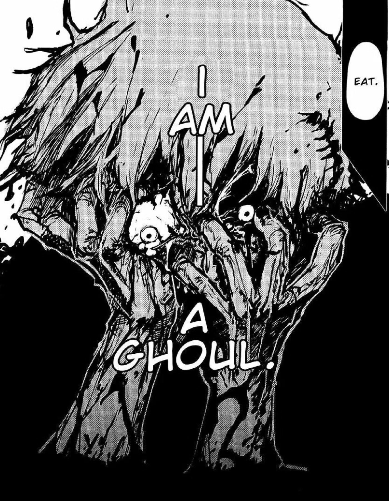
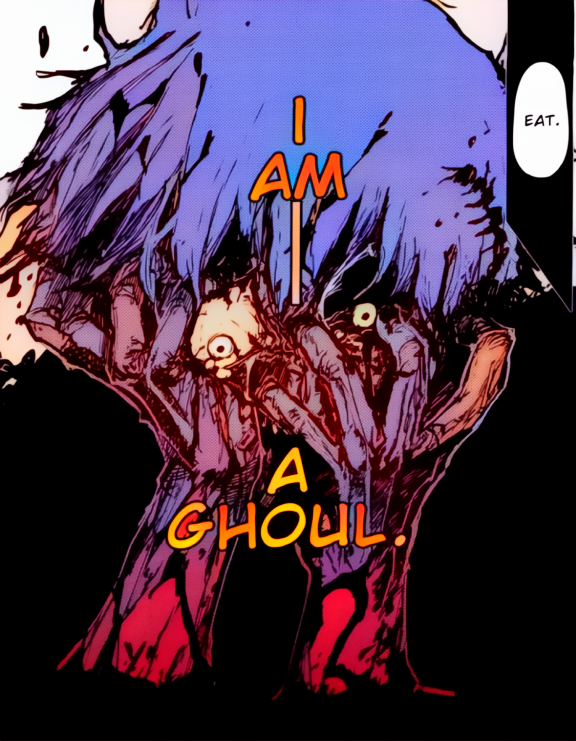
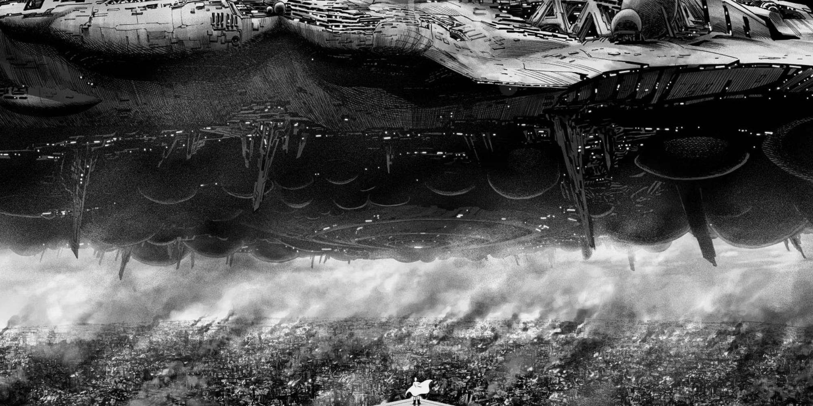
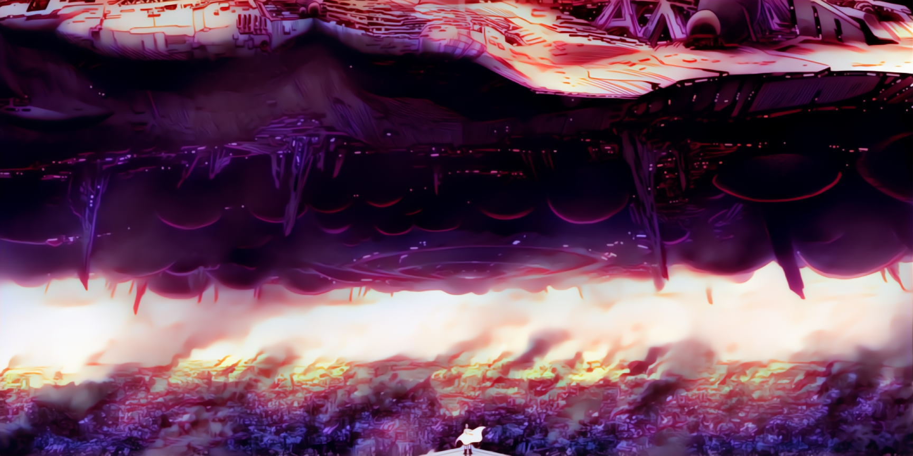

# Automatic colorization

1. Download [generator](https://drive.google.com/file/d/1qmxUEKADkEM4iYLp1fpPLLKnfZ6tcF-t/view?usp=sharing) and [denoiser](https://drive.google.com/file/d/161oyQcYpdkVdw8gKz_MA8RD-Wtg9XDp3/view?usp=sharing) weights. Put generator and extractor weights in `networks` and denoiser weights in `denoising/models`.
2. To colorize image or folder of images, use the following command:
```
$ python inference.py -p "path to file or folder"
```

| Original      | Colorization      |
|------------|-------------|
|  |  |
|  |  |
|  |  |
|  |  |
|  |  |
|  |  |
